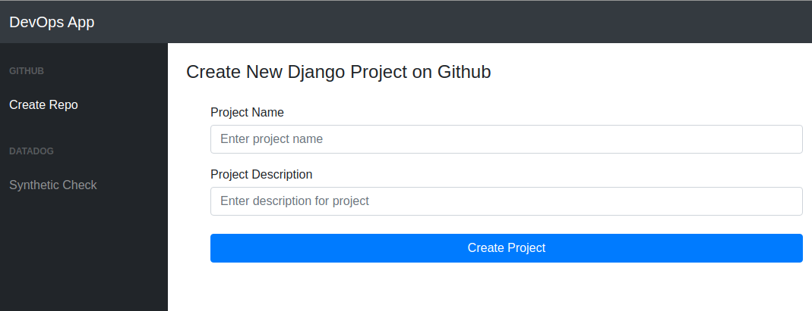
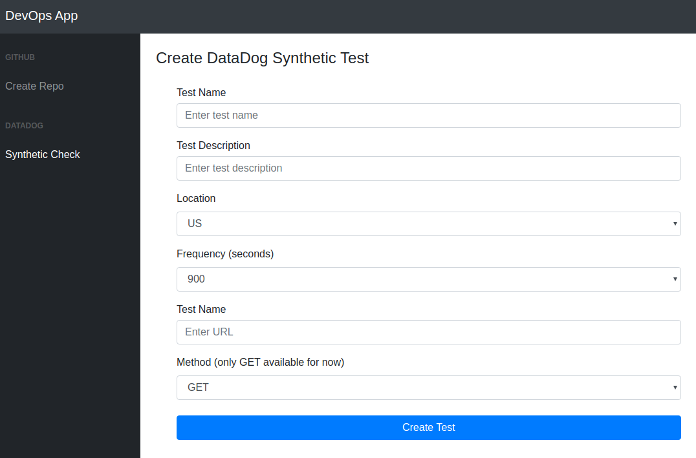
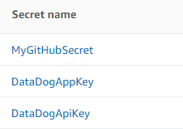
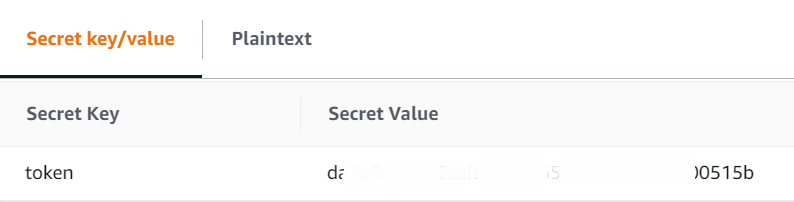
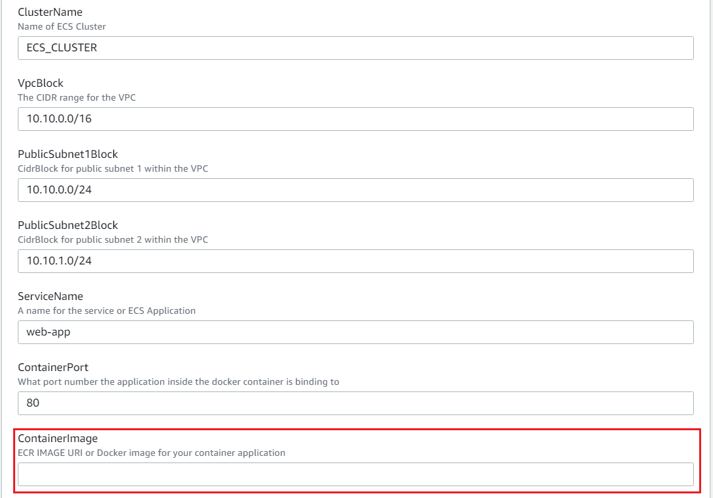
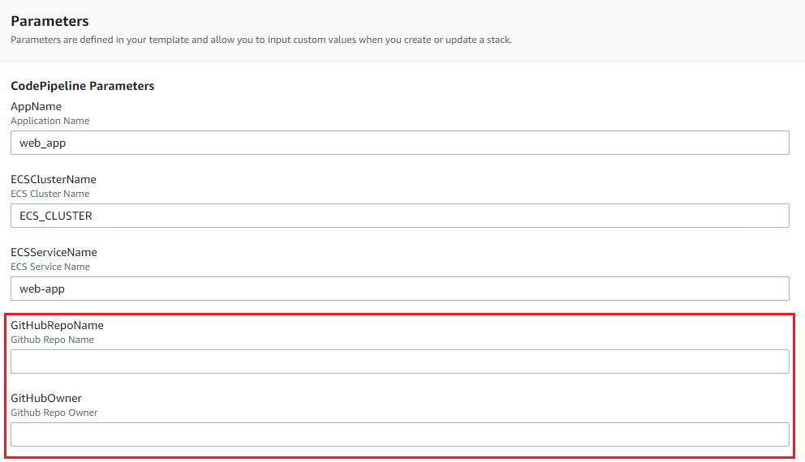

Django DevOps web application
---------------------------

This web application allows users to create a Github repository with a Django project on it. At the same time, a DataDog event is also created. 



The second menu of the application gives users the ability to create Synthetic Tests in DataDog. 




Installation
--------------

Before running the application, you need to create a [token for your Github account](https://help.github.com/en/github/authenticating-to-github/creating-a-personal-access-token-for-the-command-line) and create [DataDog API and aplication keys](
https://docs.datadoghq.com/account_management/api-app-keys/). 

Then, you need to create [secrets](https://console.aws.amazon.com/secretsmanager) in aws to store the token and the keys. 



Please make sure to name the GitHub token - MyGitHubSecret and the key - token.



These secrets will be passed to the docker image from the task definition in ECS in the format {"key_name": "key_value"}

The Dajango application reads these values from the environment variables. 

[GitRepo.py](app_code/web_app/lib/GitRepo.py)
```
def __init__(self):
        # Connect to Github account with token
        # Getting token from environment variable
        git_token = os.environ.get('git_token')
        self.token = git_token[10:-2]
        self.g = Github(self.token)
```
[DataDog.py](app_code/web_app/lib/DataDog.py)
```
 def __init__(self):
        # Getting keys from environment variables
        api_key = os.environ.get('datadog_api_key')
        app_key = os.environ.get('datadog_app_key')
        options = {
            'api_key': api_key[8:-2],
            'app_key': app_key[8:-2]
        }
        initialize(**options)
```

A Docker container image can be built using the [Dockerfile](Dockerfile). 

``
docker build -t user/devops_app .
``

Default login credentials for the application.

```
username - admin
password - DevOps2020!
```

AWS Deployment
--------------

The CloudFormation template [aws_ecs_cloudformation.yaml](aws_ecs_cloudformation.yaml) will help you to deploy this application in AWS ECS. First, you need to push the container image to a public repository like EKS or Docker Hub. Then, you specify the image URL and the secrets ARN (DataDog API keys and GitHub token) as parameters when you create the CloudFormation stack.  




CodePipeline
--------------

You can automate the deployement of new releases using a CodePipeline define in the CloudFormation template [aws_ecs_cloudformation.yaml](aws_ecs_cloudformation.yaml)

Every time that new code is pushed to the master branch of the repository, CodePipeline will start running automatically. First, CodeBuild creates the Docker image and push it to the ECR repository (these stpes are configured in the (buildspec.yml)[buildspec.yml] file. Then, CodePipeline will update the ECS service with a copy of the existing task definition but using the new container image.  




