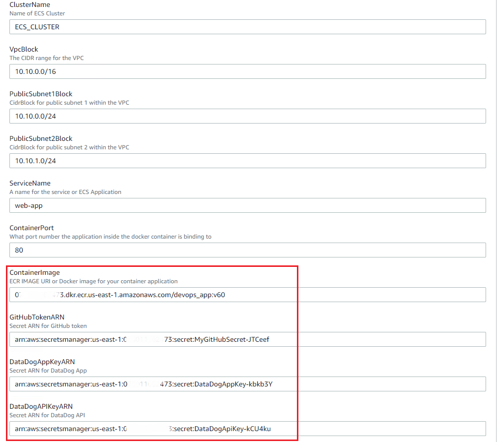

Django DevOps web application
---------------------------

This web application allows users to create a Github repository with a Django project on it. At the same time, a DataDog event is also created. 


The second menu of the application gives users the ability to create Synthetic Tests in DataDog. 


Installation
--------------

Before running the application, you need to create a [token for your Github account](https://help.github.com/en/github/authenticating-to-github/creating-a-personal-access-token-for-the-command-line) and create [DataDog API and aplication keys](
https://docs.datadoghq.com/account_management/api-app-keys/). 

Please enter the Github token on the file [GitRepo.py](app_code/web_app/lib/GitRepo.py) line #10.
```
def __init__(self):
        # Connect to Github account with token
        self.token = ""
        self.g = Github(self.token)
        self.u = self.g.get_user()
```

Please enter DataDog API and application keys on the file [DataDog.py](app_code/web_app/lib/DataDog.py) line #7 and #8.
```
 def __init__(self):
        options = {
            'api_key': '',
            'app_key': ''
        }
initialize(**options)
```


A Docker container image can be built using the [Dockerfile](Dockerfile). 

``
docker build -t user/devops_app .
``

Default login credentials for the application.

```
username - admin
password - DevOps2020!
```

AWS Deployment
--------------

The CloudFormation template [aws_ecs_cloudformation.yaml](aws_ecs_cloudformation.yaml) will help you to deploy this application in AWS ECS. First, you need to push the container image to a public repository like EKS or Docker Hub. Then, you specify the image URL as a parameter when you create the CloudFormation stack.  




